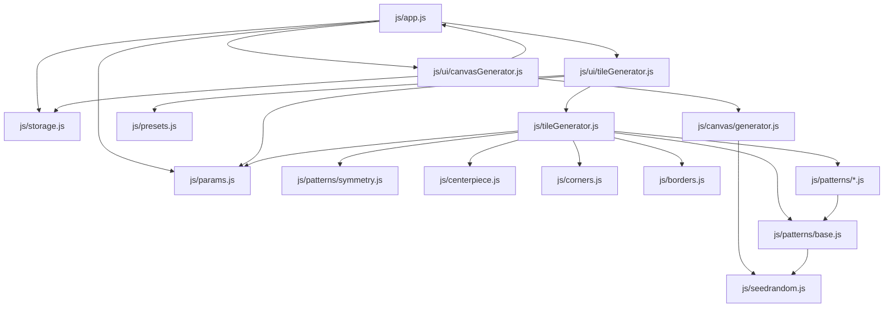

# Project Architecture - Lissabon

This document describes the software architecture, module dependencies, and component structure of the Lissabon Azulejo Generator.

## Overview

Lissabon is a modular, client-side JavaScript application for generating procedural SVG patterns. It follows a clear separation of concerns between UI management, parameter handling, and the core generation engine.

## Dependency Graph

## Core Modules

### 1. Application Controller ([`js/app.js`](js/app.js))
The entry point of the application. It initializes UI modules, manages view switching (Generator vs. Canvas), and handles global event listeners.

### 2. Parameter Management ([`js/params.js`](js/params.js))
The "Source of Truth" for the application state. It stores all generation parameters, handles synchronization between the DOM and the internal state, and provides methods for JSON serialization.

### 3. Generation Engines
- **Tile Generator ([`js/tileGenerator.js`](js/tileGenerator.js))**: Orchestrates the creation of a single tile SVG by combining patterns, borders, corners, and centerpieces.
- **Canvas Generator ([`js/canvas/generator.js`](js/canvas/generator.js))**: Handles the placement of multiple tiles into a larger grid, supporting clustering, rotation, and overlapping effects.

### 4. Pattern Modules ([`js/patterns/`](js/patterns/))
A collection of specialized modules for different visual styles:
- **[`base.js`](js/patterns/base.js)**: Provides shared utilities and RNG initialization.
- **[`geometric.js`](js/patterns/geometric.js)**, **[`floral.js`](js/patterns/floral.js)**, etc.: Implement specific pattern generation logic.
- **[`advanced.js`](js/patterns/advanced.js)**: Contains complex generators like Celtic knots, Moroccan zellij, and Baroque scrolls.

### 5. UI Modules ([`js/ui/`](js/ui/))
- **[`tileGenerator.js`](js/ui/tileGenerator.js)**: Manages the sidebar controls, keyboard shortcuts, and real-time preview updates for the single tile view.
- **[`canvasGenerator.js`](js/ui/canvasGenerator.js)**: Manages the tile gallery, selection logic, and canvas-specific settings.

### 6. Supporting Modules
- **[`storage.js`](js/storage.js)**: Handles `localStorage` for saving configurations and provides SVG/PNG export functionality.
- **[`presets.js`](js/presets.js)**: Defines predefined color palettes and provides methods to apply them.
- **[`seedrandom.js`](js/seedrandom.js)**: A third-party library for seeded pseudo-random number generation.

## Data Flow

1. **User Interaction**: User changes a slider or select box in the UI.
2. **State Update**: The UI module calls `Params.updateFromDOM()`.
3. **Trigger Generation**: The UI module calls `TileGenerator.generate()`.
4. **Engine Execution**: `TileGenerator` reads current params, initializes the RNG, and calls various pattern modules.
5. **Rendering**: The generated SVG string is injected into the DOM preview element.
6. **Export**: When requested, `Storage` captures the SVG from the DOM and triggers a download or conversion to PNG.
