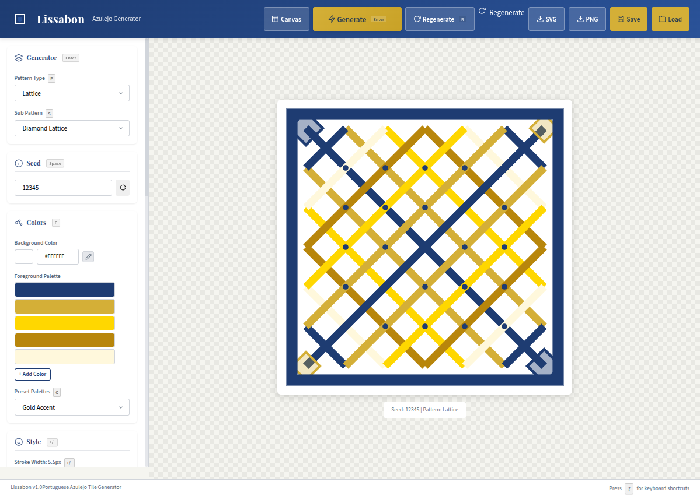
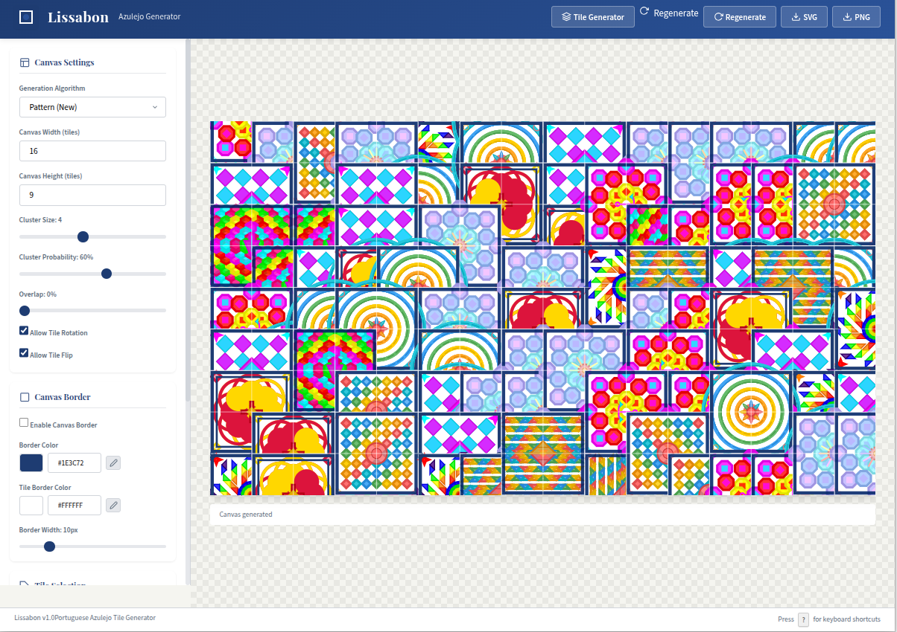

# Lissabon - Portuguese Azulejo Tile Generator

A web-based decorative tile generator inspired by traditional Portuguese azulejo ceramics. Generate beautiful, authentic-looking tiles with extensive customization options.


## Features

### Pattern Generators
- **Geometric** - Grid, diamond, hexagonal, triangle, and wave patterns
- **Floral** - Rosette, vine, branch, and paisley motifs
- **Ornamental** - Traditional Portuguese corda, arabesque, and star patterns
- **Striped** - Horizontal, vertical, diagonal, chevron, and wave lines
- **Checker** - Classic, compound, harlequin, and frame patterns
- **Radial** - Mandala, sunburst, target, and spiral designs
- **Celtic** - Knot, braid, chain, and spiral interlacements
- **Moroccan** - Zellij, gidra, muqarnas, and lattice patterns
- **Baroque** - Royal, floral-baroque, scroll, and architectural designs

### Customization Options
- **Seed-based generation** - Reproducible results from the same seed
- **Color palettes** - Multiple preset palettes (Traditional Portuguese, Blue, Earth Tones, etc.)
- **Custom colors** - Background and foreground color pickers
- **Style controls** - Stroke width, fill opacity, and complexity sliders
- **Symmetry modes** - None, horizontal mirror, vertical mirror, quadruple, 4-fold rotational, 8-fold radial
- **Borders** - Simple, double, and ornate border styles
- **Corners** - Simple, flourish, and diamond corner decorations
- **Centerpiece** - Optional center elements (circle, star, flower, diamond)

### Export & Save
- Export as **SVG** (scalable vector graphics)
- Export as **PNG** (high-resolution raster)
- Save and load configurations locally
- Grid preview (2×2, 3×3, 4×4)

## Screenshots

### Application Interface





### Generated Tile Collections


## Quick Start

### Option 1: Run Locally
```bash
# Clone or navigate to the project
cd Lissabon

# Start the development server
python3 -m http.server 8080
# or
./start.sh

# Open in browser
open http://localhost:8080
```

### Option 2: Use the Test Suite
```bash
# The test-tiles.html provides a comprehensive testing interface
# Open in browser
http://localhost:8080/test-tiles.html
```

## Project Structure & Architecture

Lissabon is built with a modular architecture, separating UI, state management, and generation logic.

- **[`ARCHITECTURE.md`](ARCHITECTURE.md)** - Detailed technical documentation and dependency graph.
- **[`js/app.js`](js/app.js)** - Main application controller and view switcher.
- **[`js/params.js`](js/params.js)** - Centralized parameter management (Source of Truth).
- **[`js/tileGenerator.js`](js/tileGenerator.js)** - Core engine for single tile generation.
- **[`js/canvas/generator.js`](js/canvas/generator.js)** - Engine for multi-tile canvas layouts.
- **[`js/patterns/`](js/patterns/)** - Specialized pattern generation modules (Geometric, Floral, Celtic, etc.).
- **[`js/ui/`](js/ui/)** - UI-specific logic for the Tile and Canvas views.
- **[`js/storage.js`](js/storage.js)** - Local storage and file export (SVG/PNG) utilities.

## Usage

### Generate a Tile
1. Select a pattern type from the dropdown
2. Choose a sub-pattern (varies by type)
3. Adjust colors, style, symmetry, and border options
4. Click "Generate Tile" or press Enter

### Regenerate with Same Settings
Click "Regenerate" to create a new variation with the same parameters but different random elements.

### Randomize
Click the random seed button to generate a completely new random tile.

### Export
- Click "SVG" to download as vector graphics
- Click "PNG" to download as high-resolution image

### Save Configuration
Click "Save" to store your current settings. Use "Load" to restore saved configurations.

### Grid Preview
Enable "Show Grid Preview" to see how tiles look when repeated in a grid.

## Technical Details

### SVG-Based Generation
All tiles are generated as SVG (Scalable Vector Graphics), ensuring:
- Infinite scalability without quality loss
- Clean, valid XML output
- Easy editing in vector graphics software
- Small file sizes

### Seed-Based Randomization
Uses a seeded PRNG (Pseudo-Random Number Generator) for:
- Reproducible results from the same seed
- Deterministic variation within parameters
- Consistent behavior across browsers

### Color System
- Traditional Portuguese azulejo color palettes
- Custom foreground palette (up to 5 colors)
- Automatic color darkening for strokes

## Browser Support

Tested and working in:
- Chrome/Chromium
- Firefox
- Safari
- Edge

## License

MIT License - Feel free to use and modify for your projects.

## Acknowledgments

Inspired by the beautiful Portuguese ceramic tiles (azulejos) found throughout Lisbon and Portugal. This is a generative art project, not a copy of any specific historic tile design.
